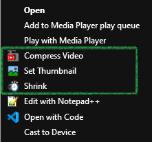

[//]: # (Constants)
[privacy-link]: ./PRIVACY.md
[coffee-link]: https://buymeacoffee.com/spark88
[issues-link]: ../../issues
[releases-link]: ../../releases/latest

# 🖼️ PicLet - Image Tools for Windows

Handy right-click tools for everyday image tasks!

[][coffee-link] 
[][issues-link]
[][releases-link]

## ✨ Features

-  **Create Icons**: Convert PNG images to ICO files with multiple resolutions
-  **Remove Background**: Quickly remove backgrounds from PNG images

## 🚀 Quick Start
1. [Download the latest release][releases-link]
2. Run `install_piclet.bat` as Administrator
3. Right-click on PNG files to access new context menu options!

## 💡 How to use
-  **Make Icon**: Right-click on any PNG file → Select "Make Icon"
-  **Remove Background**: Right-click on any PNG file → Select "Remove Background"

## 🌱 Support & Contributions
If these tools save you time:
- Please ⭐ <a href="../../stargazers" target="_blank">Star</a> to help spread useful tools.
- <a href="[coffee-link]" target="_blank">Buy me a coffee</a> to fuel more dev tools.
- or <a href="../../fork" target="_blank">Contribute</a> - Released under MIT license.

---

Released under MIT License | <a href="[privacy-link]">Privacy Policy</a>

